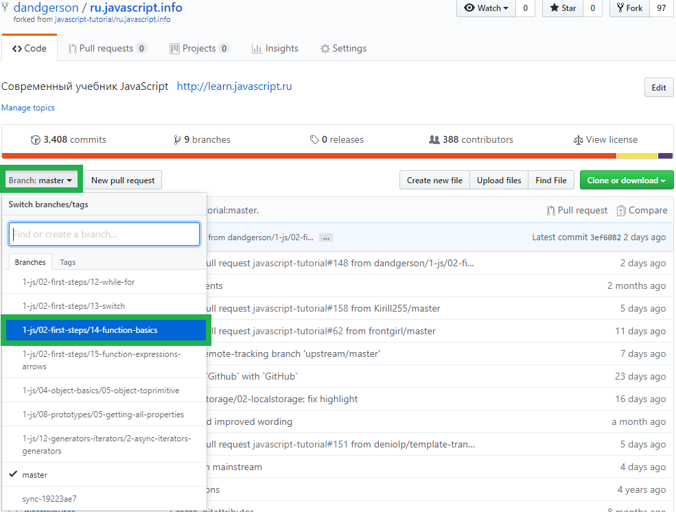
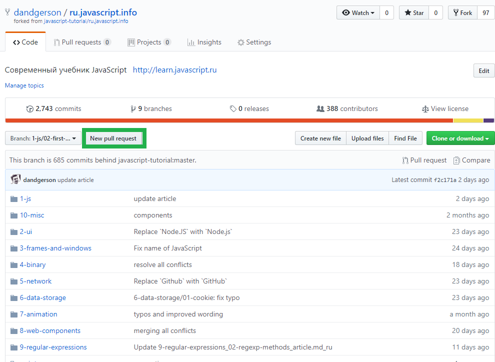
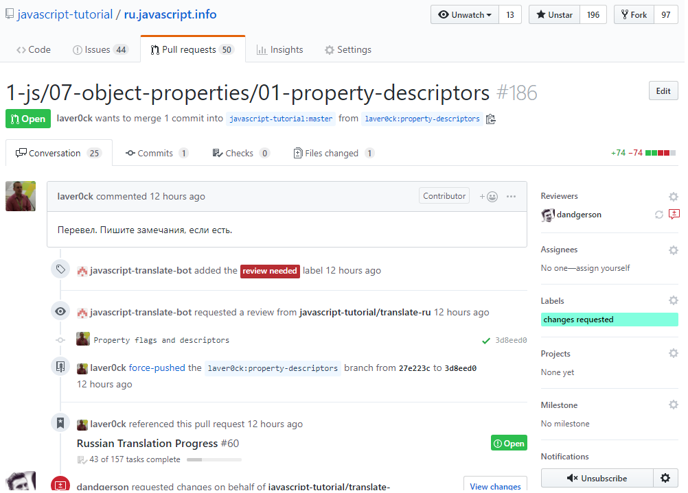
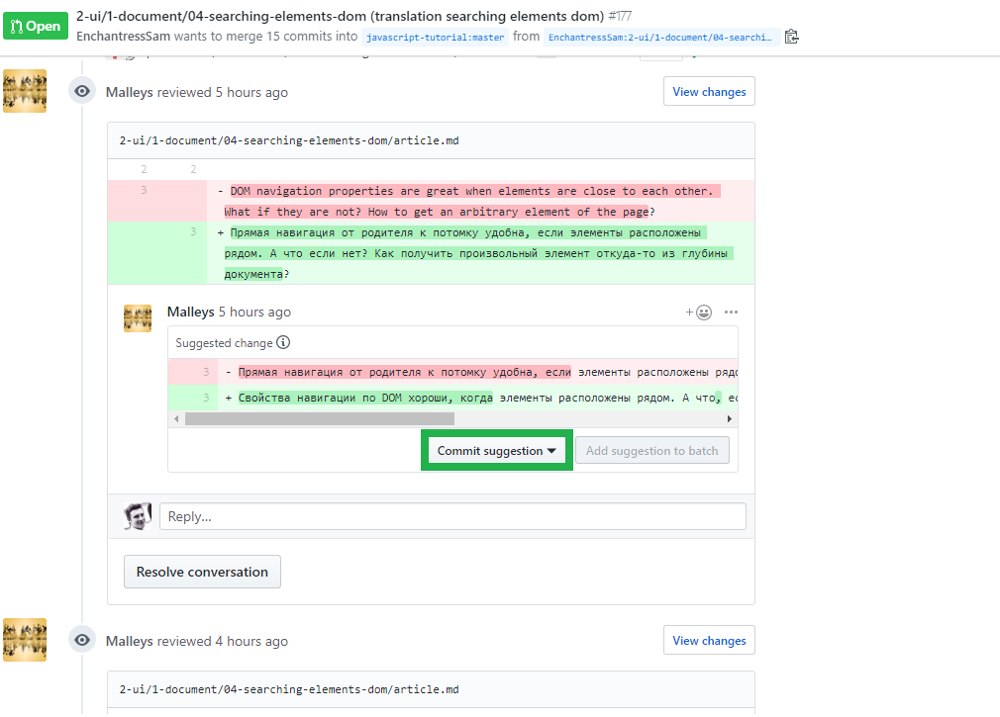
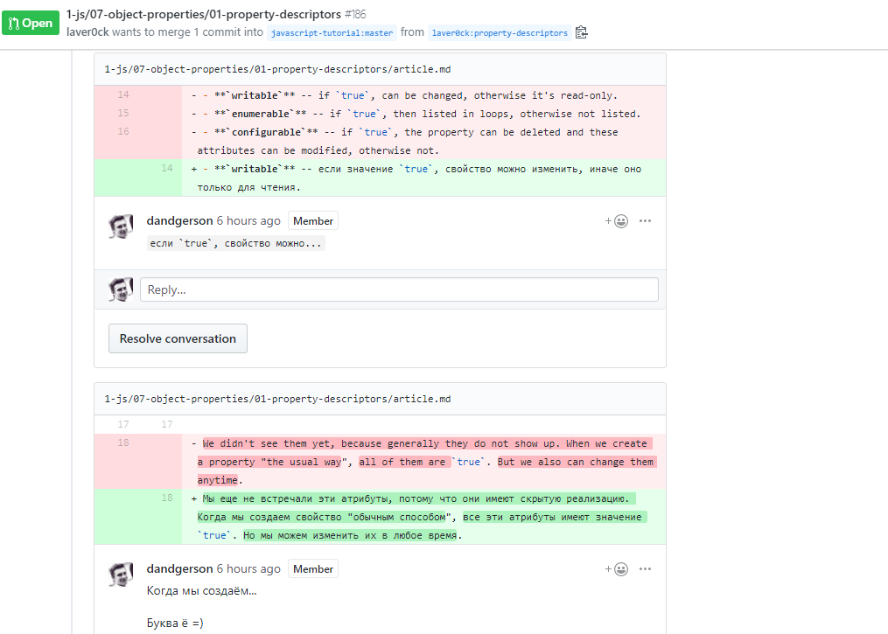
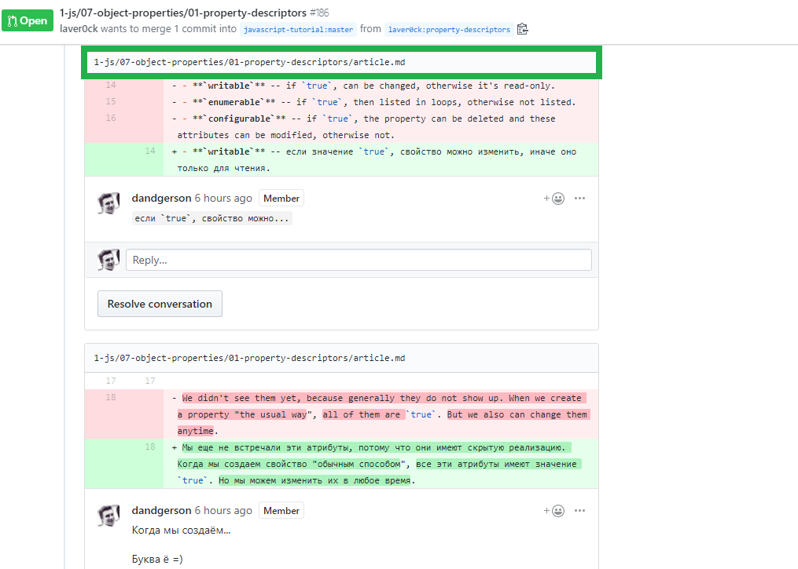
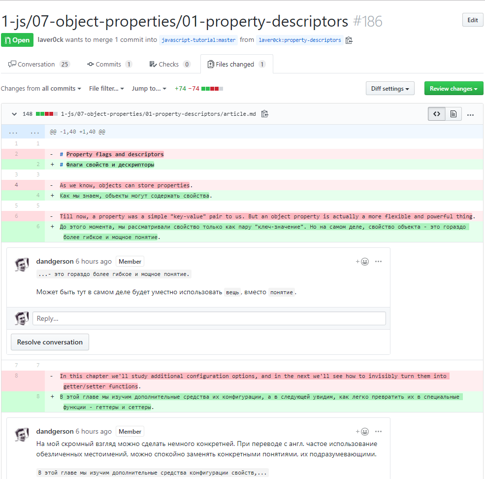
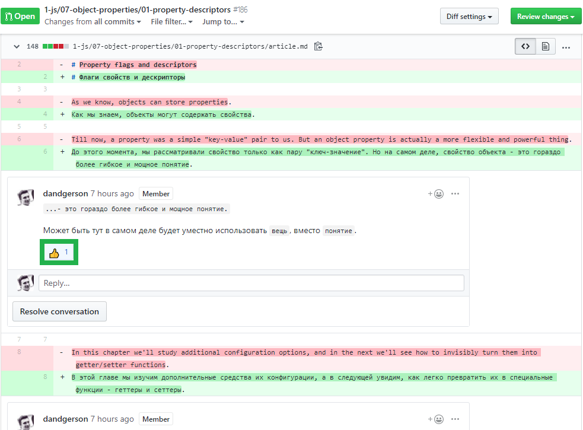
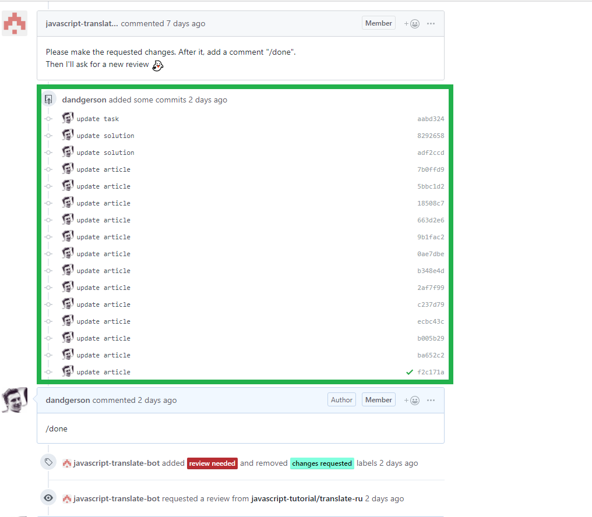
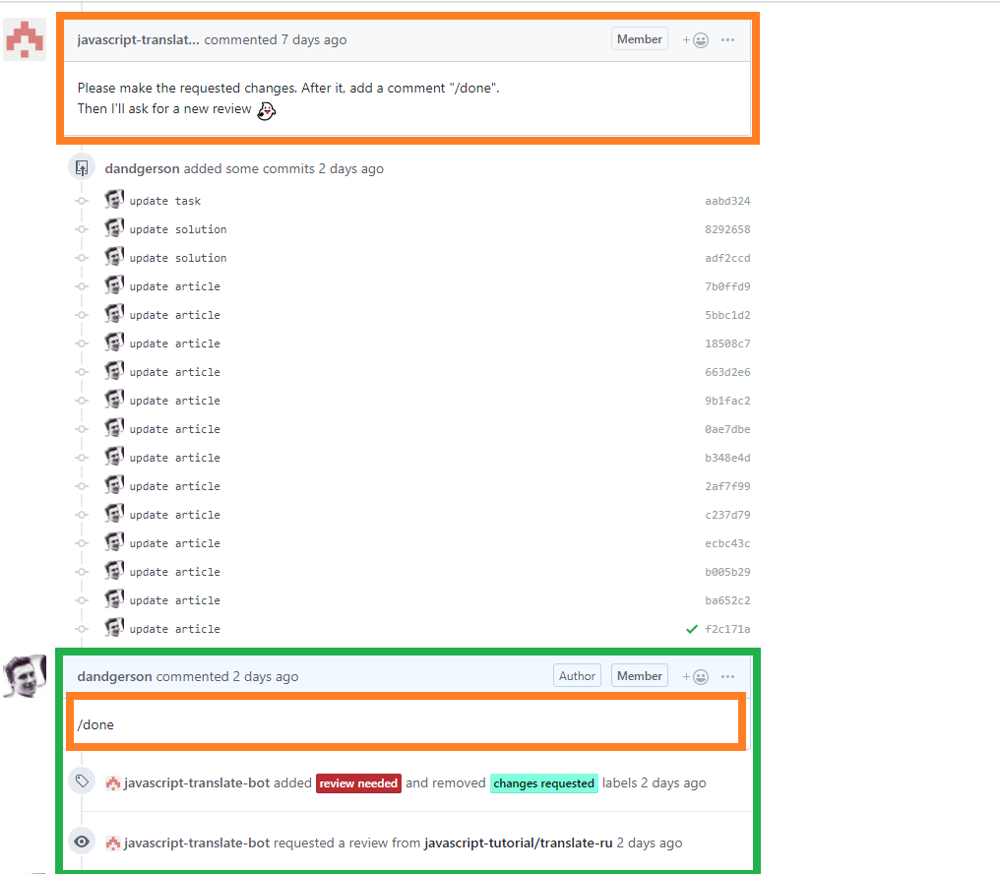

# Main manual

## Getting started

For start working with this repo you should first make new branch named like article path (it needs for better maintainance)

1. clone forked repo on you local

  input: `>`,
  output: `<`

```sh

  > git clone https://github.com/{your name}/ru.javascript.info`
  > cd ru.javascript.info
```

2. Now we are in the project folder. Next step, that we need to make -- is create a new branch on wich we want to make our contribution. Suppose we want to translate article on this path `1-js/02-first-steps/14-function-basics/article.md`. Here what we should do for it:

```sh
  // now we are on branch: master
  > git branch // check our branches
  < * master // current

  > git checkout -b 1-js/02-first-steps/14-function-basics // create and checkout on new branch
  > git branch // check our branches
  < master
    * 1-js/02-first-steps/14-function-basics // current
```

3. Suppose we translated and commit our changes. Now we need to push our commits from new branch to our fork.

```sh
  > git add . && git commit -m 'our commit' // add and commit our changes
  > git push --set-upstream origin 1-js/02-first-steps/14-function-basics // push our commits on new branch on remote fork

  // Now if we check our remote branches we can seeing our new branch with commits
  > git branch -r
  < origin/1-js/02-first-steps/14-function-basics
    origin/HEAD -> origin/master
    origin/master
```

4. After that, we need to create a Pull Request (PR) with our changes. On `https://github.com/{your-name}/ru.javascript.info` checkout to our new branch with commits:



5. Next -- push button: `New pull request` and fill form PR.



Congrats! Now you are the new contributor!

Watch the PR progress, reviews and comments.

## Make another one translation

Making another translation you will need to update your fork. (Important changes could occur while we were translating.)

1. First update our fork. It's easy.

```sh
  // from the root project folder
  > git checkout master
  > git pull https://github.com/javascript-tutorial/ru.javascript.info // pull last changes from original repo to our local
  > git push // push it to our remote fork
```

2. Now do steps 2 - 5 from "Getting started" section with appropriate names and paths

## How to handle review

After you make the PR, you will definitely receive a review with corrections. This is how they are usually treated:

1. Go to page with your PR. It should looks like:



2. You'll see the commit suggestion or comments with it

  - case: commit suggestion -- just push the same named button. Thats all.



  - case: comment with change suggestion -- you'll need to commit it your own.



For more convenient viewing of comments click the link with article:



Now all comments in all place without collapsed



Great! Now you are ready to commit suggestioned changes.

3. In your local repo checkout to need branch (let it be the our first branch, that we create in begin).

```sh
  > git checkout 1-js/02-first-steps/14-function-basics
```

4. Now find need place, do need changes and commit them.

```sh
  > git add . && git commit -m 'update article'
```

5. After that return to github page with comment and mark it with `thumbs up emoji` for example



6. After you process all review comments in this way, push your commits

```sh
  > git push
```

and they will appear on github PR page.



7. Note the messages of the bot. Don't ignore them. Leave them a comment to change PR status



Thats all!

## Working on another machine

Sometimes we want to work on another machine.

1. Clone your fork

```sh
  > git clone https://github.com/{your name}/ru.javascript.info`
  > cd ru.javascript.info
```

2. After clone your fork you'll need to checkout your working branch.

```sh
  // Check our remote branches
  > git branch -r
  < origin/1-js/02-first-steps/14-function-basics // our remote working branch
    origin/HEAD -> origin/master
    origin/master

  // make new local, attach it to our remote working branch and checkout on it
  > git checkout -b 1-js/02-first-steps/14-function-basics origin/1-js/02-first-steps/14-function-basics
```

Thats all! Now you ready for work!
